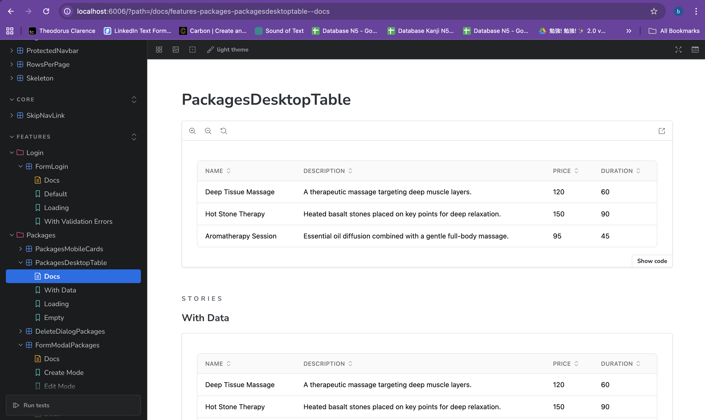
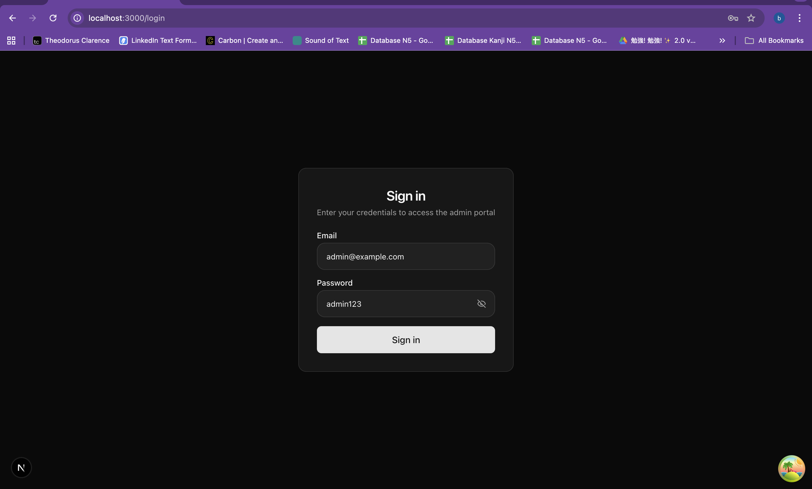
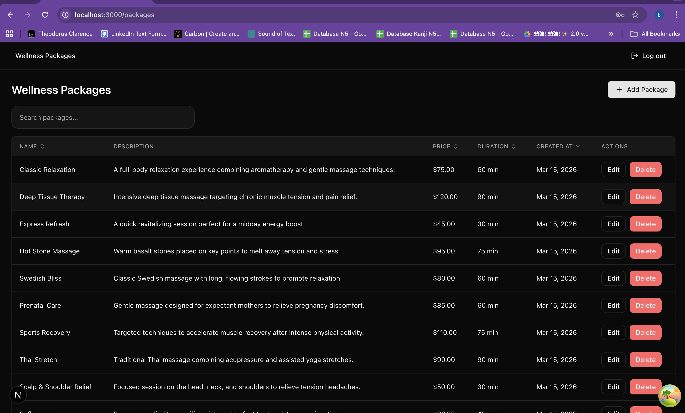
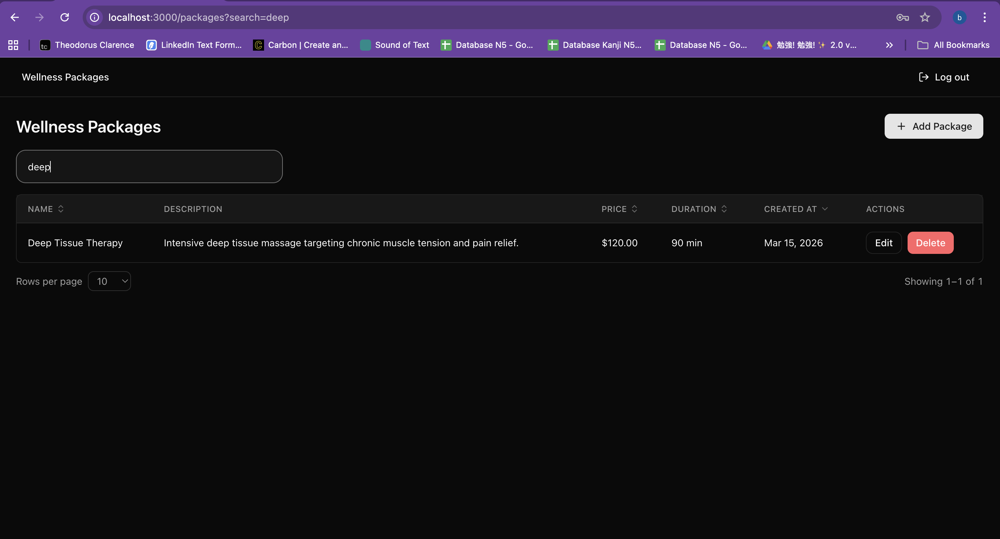
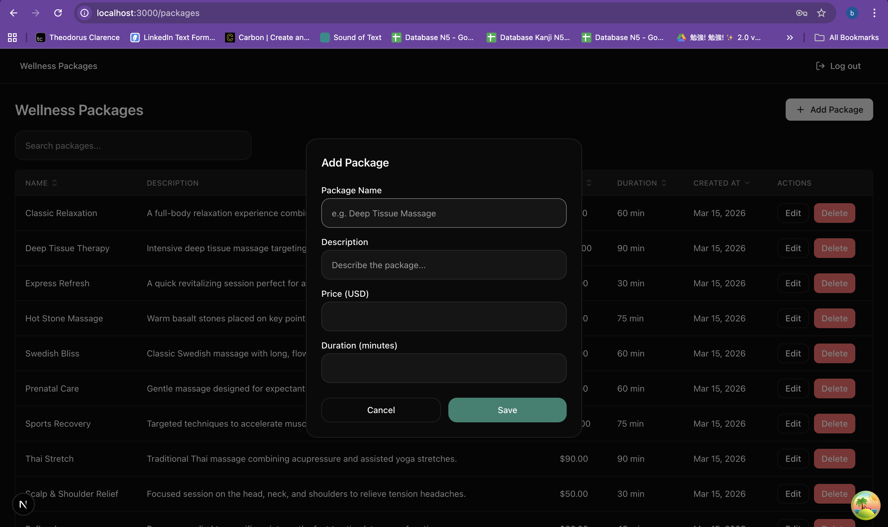
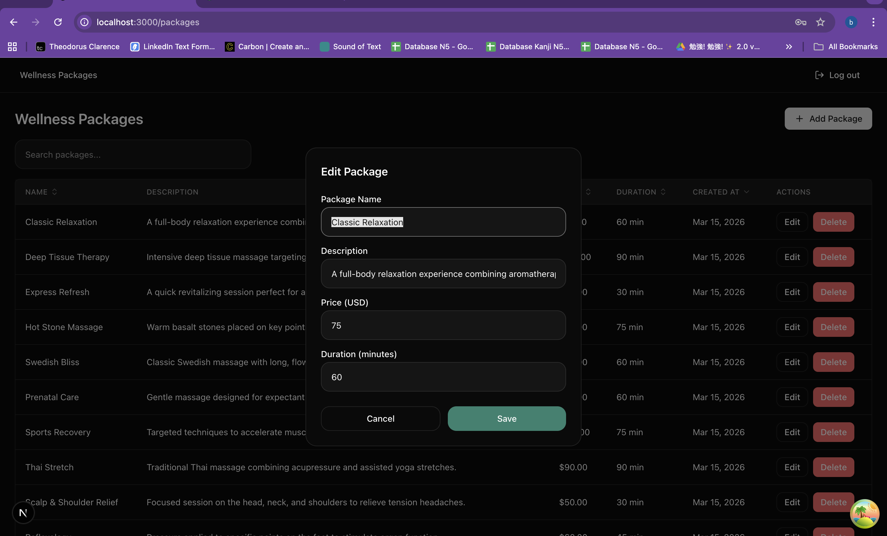
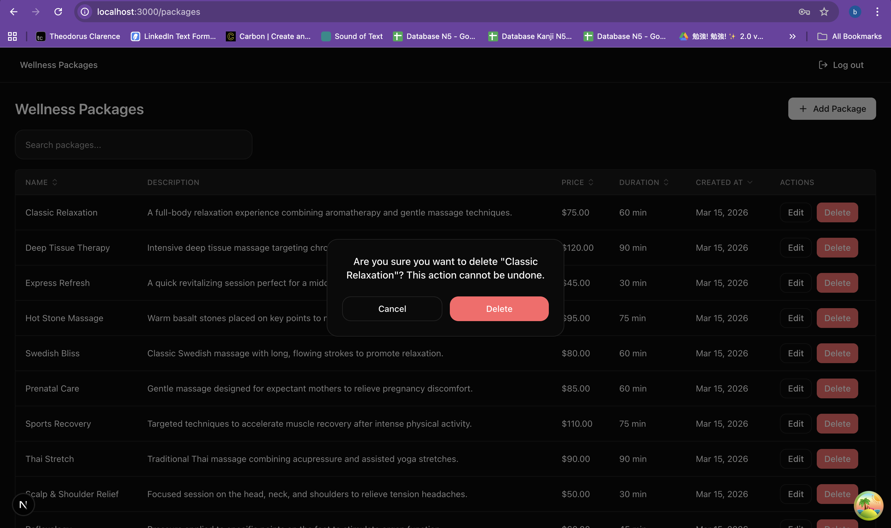

# TUG Wellness Admin Portal

Admin portal for managing Wellness Packages — built as part of the TUG Full Stack (Dart & TypeScript) Technical Assessment.

---

## Overview

This is the **Admin Portal** (Part 2 of the assessment). It connects to the TUG NestJS backend and provides a complete package management interface: view, create, edit, and delete Wellness Packages.

- **Live at**: `http://localhost:3000`
- **Backend required**: TUG backend running at `http://localhost:4000`
- **Routes**: `/login` → `/packages` (protected)

---

## Tech Stack

| Category           | Choice                                            |
| ------------------ | ------------------------------------------------- | -------------------------------------- |
| Framework          | Next.js 15 (App Router)                           |
| Language           | TypeScript (strict mode)                          |
| Styling            | Tailwind CSS v4 + shadcn/ui                       |
| Server State       | TanStack Query v5                                 |
| Client State       | Zustand                                           |
| Validation         | Zod                                               |
| API Client         | Axios + Orval (code-generated from OpenAPI)       |
| Auth               | JWT via httpOnly cookie + Zustand in-memory store |
| i18n               | next-intl (English + German)                      |
| Testing            | Vitest + React Testing Library                    |
| Component Explorer | Storybook v8                                      |
| Linting            | ESLint (flat config) + Prettier                   |
| Git Hooks          | Lefthook (monorepo root) + lint-staged            | Pre-commit lint, commit-msg validation |
| Containerization   | Docker (multi-stage, standalone output)           |

---

## Project Structure

```
admin-portal/
├── app/                    # Next.js App Router — routing manifest only
│   └── [locale]/
│       ├── (auth)/         # Auth route group (no navbar)
│       │   └── login/
│       └── (protected)/    # Protected route group (with navbar)
│           └── packages/
│
├── features/               # Feature-first modules
│   ├── login/
│   └── packages/
│
├── core/                   # Shared infrastructure
│   ├── api/                # Axios instance + Orval-generated hooks
│   ├── components/         # Reusable UI components
│   ├── i18n/               # next-intl routing, request, translations
│   ├── lib/                # Utilities, env validation, route constants
│   └── providers/          # QueryProvider, ThemeProvider
│
└── public/                 # Static assets
```

Each **feature folder** follows its own consistent structure:

```
features/[feature]/
├── container/       # Layout orchestrator — positions sections, zero state
├── sections/        # Self-contained UI units with their own state & API calls
├── react-query/     # Wrappers around Orval hooks with toast & cache logic
├── store/           # Zustand store for cross-section shared state (if needed)
├── react-table/     # TanStack Table column definitions (if needed)
└── utils/           # Feature-specific helpers (if needed)
```

---

## Architecture

This project follows **Feature-Based Architecture**, influenced by Feature-Sliced Design (FSD), adapted for Next.js App Router.

### Core Principles

**`app/` — Routing manifest only**
Pages in `app/` contain a single line: return the feature container. No logic, no state, no styling lives here. Features remain portable and independently testable.

**Container — Layout orchestrator only**
The container arranges sections on the page (grid, flex, spacing). It holds zero state and passes zero props down. When a section's behavior changes, the container never needs to touch.

**Section — Self-contained unit**
Each section owns its state, API calls, and schema. Sections communicate with each other exclusively through Zustand — never through container props. This prevents prop-drilling and enables independent development and testing.

**`react-query/` — Anti-corruption layer**
Orval-generated hooks are raw and can change on regeneration. Sections never import them directly. Instead, wrapper hooks in `react-query/` add business logic (toast on success/error, cache invalidation). If Orval renames a hook, only one wrapper file needs updating.

**Schema — Colocated with its section**
Zod schemas for forms live inside the section folder that uses them. If a schema is shared across sections, it moves to `utils/`.

**Conditional folder creation**
No folder is created "just in case". `store/` exists only if cross-section state is needed. `react-table/` exists only for complex column definitions. Every created folder has an `index.ts` barrel export.

### State Management Strategy

| Type                     | Tool                                          |
| ------------------------ | --------------------------------------------- |
| Server state (API data)  | TanStack Query                                |
| Auth state (user, token) | Zustand (`features/auth/store/auth.store.ts`) |
| Cross-section UI state   | Zustand (per-feature store)                   |
| Local component state    | React `useState`                              |

### Auth Flow

1. User submits login form → `POST /api/v1/auth/login` via Orval-generated hook
2. On success: token stored in Zustand (`setAuth()`) + written to httpOnly cookie via `POST /api/auth/session` Route Handler
3. Axios interceptor reads token from Zustand store and injects it as `Bearer` header on every request
4. Next.js middleware reads the httpOnly cookie to protect routes server-side
5. On logout: `DELETE /api/auth/session` clears the cookie → `clearAuth()` clears Zustand → redirect to `/login`
6. Token refresh is handled by the Axios error interceptor (raw axios, outside React context)

### API Layer

The API client is **fully code-generated** from the backend's OpenAPI spec using Orval. Developers never write API call code manually. After any backend schema change, run `npm run api:generate` to regenerate type-safe hooks.

Generated output lives in `core/api/generated/`. Never edit these files manually.

### Internationalization

The app supports **English** (default) and **German** via next-intl.

Translation files live in `core/i18n/json/{locale}/{namespace}.json`. The locale is part of the URL: `/en/packages`, `/de/packages`. Switching languages changes the URL prefix — no page reload required.

### Architectural Decisions

**Orval over manual API clients**
Hand-written API clients drift from the backend schema over time. Orval generates fully type-safe hooks directly from the OpenAPI spec, ensuring the frontend is always in sync with the backend contract.

**Feature-first over layer-first**
Organizing by feature (`features/packages/`) instead of by layer (`components/`, `hooks/`, `services/`) keeps all related code together. Adding or removing a feature means touching one folder, not six.

---

## API Design

This portal consumes the following backend endpoints. All requests are prefixed with `/api/v1` and require a `Bearer` access token unless marked Public.

### Auth

| Method | Path                   | Auth          | Description                           |
| ------ | ---------------------- | ------------- | ------------------------------------- |
| POST   | `/api/v1/auth/login`   | Public        | Login, returns access + refresh token |
| POST   | `/api/v1/auth/refresh` | Refresh Token | Get new access token                  |
| POST   | `/api/v1/auth/logout`  | Bearer        | Revoke refresh token                  |
| GET    | `/api/v1/auth/me`      | Bearer        | Get current user profile              |

### Wellness Packages

| Method | Path                         | Auth       | Description                             |
| ------ | ---------------------------- | ---------- | --------------------------------------- |
| GET    | `/api/v1/admin/packages`     | ADMIN role | List packages (paginated, search, sort) |
| POST   | `/api/v1/admin/packages`     | ADMIN role | Create new package                      |
| PUT    | `/api/v1/admin/packages/:id` | ADMIN role | Update package                          |
| DELETE | `/api/v1/admin/packages/:id` | ADMIN role | Delete package                          |

The API client is generated via Orval from the backend's OpenAPI spec (`core/openapi/openapi.json`). Run `npm run api:generate` after any backend schema change to keep types in sync.

For full request/response shapes, see [backend/README.md](../backend/README.md#api-design).

---

## Prerequisites

- Node.js `22.22.0` (see `.nvmrc`)
- TUG backend running and accessible at `http://localhost:4000`

---

## Setup

**1. Use the correct Node.js version**

```bash
nvm use
```

**2. Install dependencies**

```bash
npm install
```

**3. Configure environment variables**

Copy `.env.example` to `.env` and set the values:

```
NEXT_PUBLIC_API_BASE_URL=http://localhost:4000
NEXT_PUBLIC_APP_URL=http://localhost:3000
```

**4. Generate API client from OpenAPI spec**

This step regenerates all type-safe API hooks from the backend's OpenAPI spec.

```bash
npm run api:generate
```

**5. Start the development server**

```bash
npm run dev
```

Open [http://localhost:3000](http://localhost:3000) in your browser.

---

## Available Scripts

| Script                    | Description                                                  |
| ------------------------- | ------------------------------------------------------------ |
| `npm run dev`             | Start development server (Turbopack)                         |
| `npm run build`           | Generate API client then build for production                |
| `npm run start`           | Start production server                                      |
| `npm run lint`            | Run ESLint                                                   |
| `npm test`                | Run unit tests (Vitest)                                      |
| `npm run api:generate`    | Regenerate Orval API client from `core/openapi/openapi.json` |
| `npm run storybook`       | Start Storybook component explorer on port 6006              |
| `npm run build-storybook` | Build Storybook as a static site                             |

---

## Testing

Unit and integration tests are written with Vitest + React Testing Library. Tests use `vi.mock` for API isolation — no real network requests are made.

```bash
npm test          # run all tests
npm run test:ui   # open Vitest UI
```

Test files are colocated with the features they test (e.g., `features/packages/container/Packages.container.test.tsx`).

### Component Stories (Storybook)

Components and sections are documented in isolation using Storybook. Stories are colocated with their components and follow the `*.stories.tsx` convention.

Run the Storybook explorer at `http://localhost:6006`:

```bash
npm run storybook
```

Stories cover:

- **Login form**: default state, loading state, error state
- **Packages table**: populated state, empty state, loading skeleton
- **FormModal**: create mode, edit mode (pre-filled)
- **DeleteDialog**: open/confirmation state

Story configuration lives in `core/storybook/`. All stories in `core/components/**` and `features/**` are automatically picked up.



---

## Assumptions

- Backend is running at `http://localhost:4000` with the TUG NestJS API
- Only `ADMIN` role users exist in this portal — no role-based access control is implemented beyond the auth guard
- The OpenAPI spec in `core/openapi/openapi.json` reflects the current backend schema. If the backend changes, re-run `npm run api:generate`
- i18n translations are functional

---

## Screenshots

### Login (`/login`)

- Email + password form with Zod validation
- Redirects to `/packages` on success
- Error handling for invalid credentials



### Wellness Packages (`/packages`) — protected

- **Table**: paginated list with columns for name, description, price, duration
- **Search**: client-side filter by package name
- **Sort**: sortable columns via TanStack Table
- **Create**: modal form to add a new package
- **Edit**: modal form pre-filled with existing package data
- **Delete**: confirmation dialog before deletion
- All mutations show toast notifications on success and failure

**Package list**



**Search**



**Create package**



**Edit package**



**Delete confirmation**



---

## Deployment

The app ships with a production-ready multi-stage `Dockerfile` that produces a minimal image (~150 MB) using Next.js standalone output.

**Stages:**

1. `deps` — installs all dependencies
2. `builder` — runs `npm run build` and produces `.next/standalone`
3. `runner` — copies only the standalone output, runs as a non-root user

**Build the image**

```bash
docker build \
  --build-arg NEXT_PUBLIC_API_BASE_URL=https://your-api.example.com \
  --build-arg NEXT_PUBLIC_APP_URL=https://your-app.example.com \
  -t tug-wellness-admin .
```

> `NEXT_PUBLIC_*` variables are baked into the JavaScript bundle at build time. They **must** be passed as `--build-arg` during `docker build`, not as `-e` at runtime.

**Run the container**

```bash
docker run -p 3000:3000 tug-wellness-admin
```

The app is served at `http://localhost:3000`. Override the port with `-e PORT=8080` if needed.
