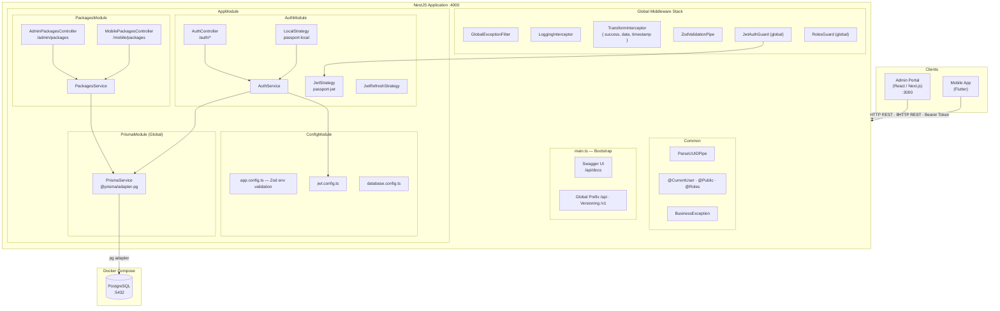
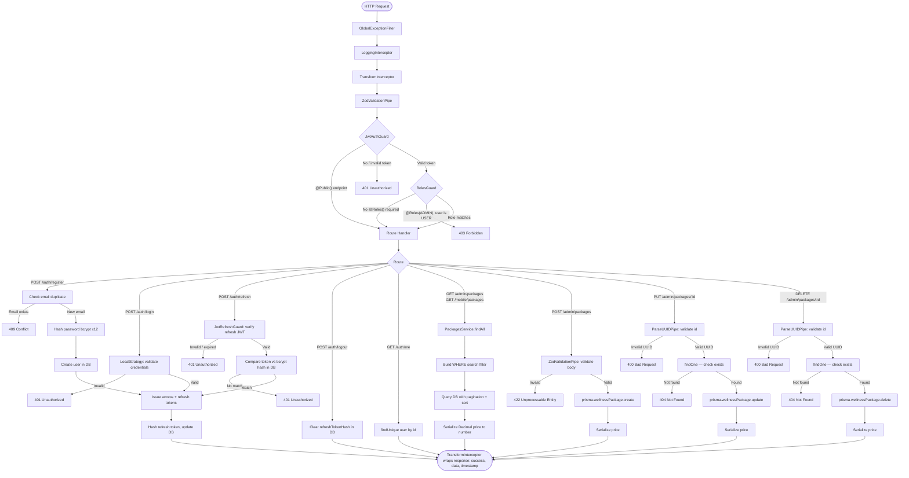
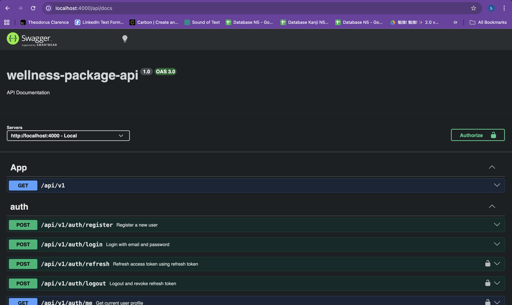
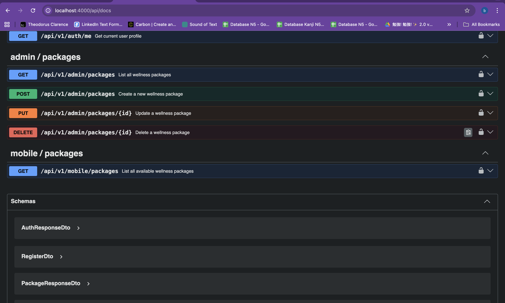

# Wellness Package Management — Backend API

Backend service for the TUG Technical Assessment. Built with NestJS + TypeScript, serving both the Admin Portal and Mobile App for managing wellness packages.

---

## Overview

This is the **Backend API** (Part 1 of the assessment). It exposes two groups of endpoints:
- **Admin API** — full CRUD for wellness packages, requires `ADMIN` role
- **Mobile API** — read-only package listing, requires any authenticated user

- **Base URL**: `http://localhost:4000`
- **API prefix**: `/api/v1`
- **Swagger docs**: `http://localhost:4000/api/docs`

---

## Tech Stack

| Layer | Choice | Reason |
|---|---|---|
| Framework | NestJS 11 | Modular, opinionated, production-ready |
| Language | TypeScript (strict mode) | Type safety, better DX |
| Database | PostgreSQL | Better standards compliance vs MySQL |
| ORM | Prisma | Type-safe client, superior migration tooling vs TypeORM |
| Validation | Zod + nestjs-zod | Schema = type automatically, Swagger auto-docs |
| Auth | JWT (access + refresh token) | Stateless, scalable |
| Docs | Swagger / OpenAPI | Auto-generated from decorators |
| Logging | Winston | Structured logs, file rotation |
| Containerization | Docker Compose | Reproducible local environment |
| Git Hooks | Lefthook (monorepo root) + lint-staged | Pre-commit lint, commit-msg validation |

---

## Project Structure

```
src/
├── common/
│   ├── constants/       # Error codes
│   ├── decorators/      # @CurrentUser, @Public, @Roles, @ApiPaginatedResponse
│   ├── dto/             # Shared DTOs (PaginationDto)
│   ├── exceptions/      # Custom business exceptions
│   ├── filters/         # GlobalExceptionFilter (handles Prisma + Zod errors)
│   ├── interceptors/    # TransformInterceptor (standard response), LoggingInterceptor
│   ├── interfaces/      # ApiResponse<T>, PaginatedResponse<T>
│   └── pipes/           # ParseUUIDPipe
├── config/              # app, database, jwt, redis configs (validated with Zod)
├── database/            # PrismaModule, PrismaService, seeds
├── modules/
│   ├── auth/            # register, login, refresh, logout, me
│   └── packages/        # CRUD wellness packages (admin + mobile)
├── app.module.ts
└── main.ts              # Bootstrap: Swagger, global pipes/filters/interceptors
```

---

## Architecture

### System Design



---

## API Design

All endpoints are prefixed with `/api/v1`.

### Auth

| Method | Path | Auth | Description |
|--------|------|------|-------------|
| POST | `/api/v1/auth/register` | Public | Register new user |
| POST | `/api/v1/auth/login` | Public | Login, returns access + refresh token |
| POST | `/api/v1/auth/refresh` | Refresh Token | Get new access token |
| POST | `/api/v1/auth/logout` | Bearer | Revoke refresh token |
| GET | `/api/v1/auth/me` | Bearer | Get current user profile |

### Admin — Wellness Packages

| Method | Path | Auth | Description |
|--------|------|------|-------------|
| GET | `/api/v1/admin/packages` | ADMIN role | List all packages |
| POST | `/api/v1/admin/packages` | ADMIN role | Create new package |
| PUT | `/api/v1/admin/packages/:id` | ADMIN role | Update package |
| DELETE | `/api/v1/admin/packages/:id` | ADMIN role | Delete package |

### Mobile — Wellness Packages

| Method | Path | Auth | Description |
|--------|------|------|-------------|
| GET | `/api/v1/mobile/packages` | Bearer | List packages (paginated) |

### Pagination, Search & Sort

Both list endpoints (`GET /admin/packages` and `GET /mobile/packages`) support the following query parameters:

| Param | Type | Default | Options / Max | Description |
|-------|------|---------|---------------|-------------|
| `page` | integer | `1` | — | Page number (1-based) |
| `limit` | integer | `10` | max `100` | Items per page |
| `search` | string | — | — | Case-insensitive search on `name` and `description` |
| `sortBy` | string | `createdAt` | `name` \| `price` \| `durationMinutes` \| `createdAt` | Field to sort by |
| `sortOrder` | string | `desc` | `asc` \| `desc` | Sort direction |

Paginated responses have the following shape inside `data`:

```json
{
  "success": true,
  "data": {
    "data": [ { "id": "...", "name": "...", "..." } ],
    "meta": {
      "total": 42,
      "page": 1,
      "limit": 10,
      "totalPages": 5
    }
  },
  "timestamp": "2026-03-14T10:00:00.000Z"
}
```

### Standard Response Format

All responses are wrapped by `TransformInterceptor`:

```json
{
  "success": true,
  "data": { "..." },
  "timestamp": "2026-03-14T10:00:00.000Z"
}
```

Error responses follow the same envelope:

```json
{
  "success": false,
  "statusCode": 404,
  "message": "Wellness package not found",
  "timestamp": "2026-03-14T10:00:00.000Z"
}
```

---

## Prerequisites

- Node.js >= 20.0.0
- npm >= 10.0.0
- Docker & Docker Compose

---

## Setup

### 1. Install dependencies

```bash
cd backend
npm install
```

### 2. Environment

```bash
cp .env.example .env.development
# Edit .env.development — at minimum set DATABASE_URL and JWT_SECRET
```

### 3. Start Database

```bash
docker-compose up -d
```

### 4. Run Migrations & Seed

```bash
npm run migration:dev   # apply migrations
npm run seed            # seed admin user + sample packages (skips if data exists)
npm run reseed          # delete existing packages then reseed (useful for re-init)
```

Default credentials (from seed):

- Admin — `admin@example.com` / `admin123`
- User — `user@example.com` / `user123`

### 5. Start Dev Server

```bash
npm run start:dev
```

- Server: `http://localhost:4000`
- Swagger: `http://localhost:4000/api/docs`

---

## Testing

### Unit Tests

```bash
npm test
```

### E2E Tests

E2E tests run against a separate test database. Set it up once before running:

```bash
# 1. Create .env.test with a dedicated test DB URL
cp .env.example .env.test
# Edit .env.test — set DATABASE_URL to your test database

# 2. Apply migrations to test DB (run once, or after adding new migrations)
NODE_ENV=test npx prisma migrate deploy

# 3. Run E2E tests
npm run test:e2e
```

> The E2E suite creates its own admin user during setup and cleans up created packages after each run.

---

## Available Scripts

| Script | Description |
|--------|-------------|
| `npm run start:dev` | Run in watch mode |
| `npm run build` | Compile to `dist/` |
| `npm run start:prod` | Run production build |
| `npm run lint` | Lint & auto-fix |
| `npm run format` | Format with Prettier |
| `npm test` | Unit tests |
| `npm run test:cov` | Unit tests with coverage |
| `npm run test:e2e` | End-to-end tests (requires `.env.test`) |
| `npm run migration:dev` | Create & apply migration |
| `npm run migration:deploy` | Apply migrations (staging/prod) |
| `npm run seed` | Seed admin user + sample packages (skips if data exists) |
| `npm run reseed` | Delete existing packages and reseed with fresh data |

---

## Auth Flow

Detailed request lifecycle — from incoming HTTP through guards, validation, and each route handler.



All endpoints are protected by `JwtAuthGuard` globally. Use `@Public()` to opt-out, `@Roles(Role.ADMIN)` to restrict to admins.

---

## Architectural Decisions

**PostgreSQL over MySQL** — Better standards compliance, native UUID support. The assessment mentions MySQL as an example only; PostgreSQL is a drop-in superior alternative.

**Prisma over TypeORM** — Auto-generated type-safe client eliminates runtime errors from query typos. Migration system is explicit and version-controlled. Schema is the single source of truth.

**Zod over class-validator** — Schema doubles as TypeScript type automatically, no need to maintain separate validation decorators and type declarations. Integrates with Swagger via `nestjs-zod`.

**Refresh token stored as bcrypt hash** — Plain refresh tokens are never stored. Even if the database is compromised, tokens cannot be reused.

**Global guards with opt-out pattern** — All endpoints require authentication by default. Public endpoints explicitly declare `@Public()`. This is safer than opt-in auth where a missing guard silently exposes an endpoint.

---

## Assumptions

- Wellness packages are not soft-deleted (hard delete on `DELETE`)
- Any authenticated user (not just ADMIN) can read packages via the mobile endpoint
- Price is stored as `Decimal(10,2)` to avoid floating-point precision issues
- Package list endpoints are paginated (default: page 1, limit 10, max 100 per page)

---

## Screenshots

**Swagger Overview**



**Swagger Packages Endpoints**


