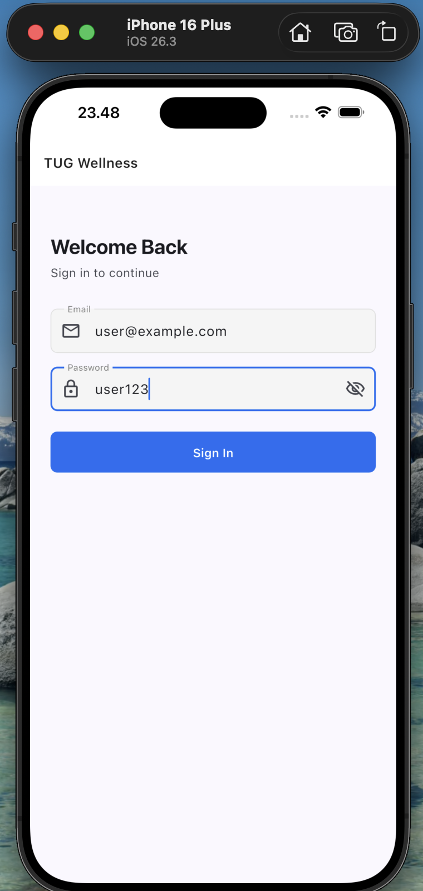
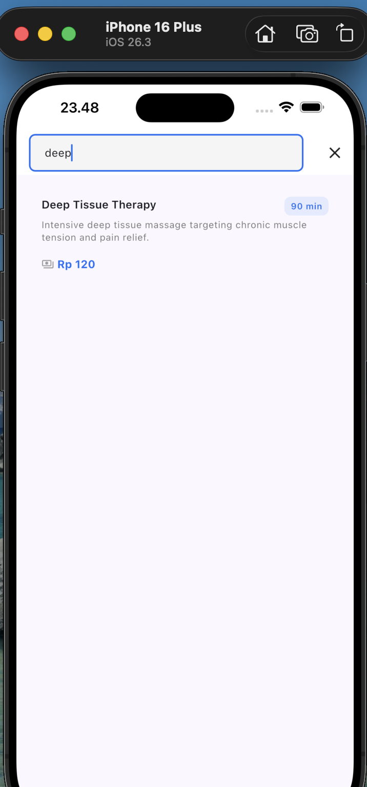

# TUG Wellness Mobile App

Mobile app for the TUG Technical Assessment. Built with Flutter + Dart, displaying wellness packages fetched from the backend API.

---

## Overview

This is the **Mobile App** (Part 3 of the assessment). It connects to the TUG NestJS backend and displays a list of wellness packages to authenticated users.

- **Backend required**: TUG backend running at `http://localhost:4000`
- **Auth**: Bearer JWT — user must be logged in before accessing the packages screen
- **Flavor**: `dev` uses a mock datasource (no real backend needed); `staging`/`production` use the real HTTP API

### Implemented Features

| Feature | Status |
|---|---|
| Fetch packages from `GET /api/v1/mobile/packages` | ✅ |
| Display package name, description, price, duration | ✅ |
| Bearer JWT authentication (via `AuthInterceptor`) | ✅ |
| Pull-to-refresh | ✅ Bonus |
| Search with debounce (400ms) | ✅ Bonus |
| Infinite scroll / pagination | ✅ Bonus |
| Currency formatting (`$1,500.00`) | ✅ Bonus |
| Shimmer loading skeleton | ✅ Bonus |
| Mock datasource for `dev` flavor | ✅ Bonus |
| Unit + widget tests (25 tests) | ✅ Bonus |

---

## Tech Stack

| Layer | Choice | Reason |
|---|---|---|
| Language | Dart | Required by assessment |
| Framework | Flutter ≥ 3.x stable | Required by assessment |
| State Management | flutter_bloc | Already used by existing features in the codebase; keeps paradigm consistent |
| Navigation | go_router | Already wired in the project with `GoRouterRefreshStream` for auth |
| DI | get_it + injectable | Environment-scoped injection — resolves mock or HTTP datasource based on flavor |
| Networking | Dio + fpdart (Either) | Typed error handling — no raw exceptions crossing layer boundaries |
| Storage | Hive + flutter_secure_storage + shared_preferences | Auth token persistence |
| Testing | mocktail + flutter_test | Unit + widget tests |
| Git Hooks | Lefthook (monorepo root) | Pre-commit: `dart format` + `flutter analyze` |

---

## Project Structure

```
lib/
├── core/                   # Constants, DI, network, router, theme, utils
├── features/               # Feature modules (Clean Architecture)
│   ├── auth/               # Login, token management, auth BLoC
│   └── wellness_packages/  # Wellness packages feature (see detail below)
├── shared/                 # Shared widgets & models
├── app.dart                # Root widget
└── main.dart               # Entry point
```

### Wellness Packages Feature

```
lib/features/wellness_packages/
├── domain/
│   ├── entities/
│   │   ├── wellness_package.dart            # Pure domain entity
│   │   ├── paginated_packages.dart          # Paginated result + hasNextPage getter
│   │   └── get_packages_params.dart         # Query params (page, limit, search, sort)
│   ├── repositories/
│   │   └── wellness_package_repository.dart # Abstract interface
│   └── usecases/
│       └── get_wellness_packages_use_case.dart
├── data/
│   ├── models/
│   │   ├── wellness_package_model.dart          # fromJson DTO
│   │   └── paginated_packages_model.dart        # Parses nested API envelope
│   ├── datasources/
│   │   ├── wellness_package_remote_data_source.dart        # Abstract
│   │   ├── wellness_package_remote_data_source_http.dart   # HTTP (staging/prod)
│   │   └── wellness_package_remote_data_source_mock.dart   # Mock (dev)
│   └── repositories/
│       └── wellness_package_repository_impl.dart
└── presentation/
    ├── blocs/
    │   ├── wellness_packages_bloc.dart
    │   ├── wellness_packages_event.dart
    │   └── wellness_packages_state.dart
    ├── pages/
    │   └── wellness_packages_page.dart
    └── widgets/
        ├── wellness_package_card.dart
        ├── wellness_package_loading.dart    # Shimmer skeleton
        ├── wellness_packages_empty.dart
        └── wellness_packages_error.dart
```

### Test Structure

```
test/features/wellness_packages/
├── domain/get_wellness_packages_use_case_test.dart        # 5 tests
├── data/wellness_package_repository_impl_test.dart        # 6 tests
└── presentation/
    ├── wellness_packages_bloc_test.dart                   # 9 tests
    └── wellness_package_card_test.dart                    # 5 tests (widget test)
```

---

## Architecture

The feature follows **Clean Architecture** with three layers:

- **Domain layer** — pure Dart entities and abstract repository interfaces, zero Flutter/platform dependencies
- **Data layer** — DTOs, datasources, repository implementation; converts raw JSON and exceptions into domain types before they cross the layer boundary
- **Presentation layer** — BLoC for state management; widgets depend only on states and events, never on the data layer directly

### Architectural Decisions

**BLoC over Riverpod / Provider**
The existing codebase already uses `flutter_bloc`. Staying consistent avoids mixing paradigms and lets `GoRouter`'s `refreshListenable` mechanism (already wired for `AuthBloc`) work uniformly across features.

**`fpdart` Either — no throwing across layer boundaries**
All errors are converted to typed `Failure` subclasses (`NetworkFailure`, `ServerFailure`, `UnauthorizedFailure`) inside the repository. The BLoC and UI never see raw exceptions, making error paths explicit and testable.

**Environment-scoped datasources (`@LazySingleton(env: [...])`)**
`get_it` + `injectable` resolves the correct datasource based on the current flavor:
- `dev` → `WellnessPackageRemoteDataSourceMock` (5 fixtures, 800ms simulated delay, no network)
- `staging` / `production` → `WellnessPackageRemoteDataSourceHttp`

This eliminates `if (kDebugMode)` scattered through business logic and lets the dev build run without a backend.

**Pagination via `PaginatedPackages.hasNextPage`**
Page tracking is derived from the current BLoC state (`current.paginatedData.page + 1`) rather than a separate `_currentPage` field, eliminating drift between mutable state and emitted states.

---

## API Design

This app consumes the following backend endpoint:

| Method | Path | Auth | Description |
|---|---|---|---|
| POST | `/api/v1/auth/login` | Public | Login, returns access token |
| POST | `/api/v1/auth/refresh` | Refresh Token | Get new access token |
| GET | `/api/v1/mobile/packages` | Bearer | List packages (paginated, search, sort) |

### Query Parameters (`GET /mobile/packages`)

| Param | Default | Description |
|---|---|---|
| `page` | `1` | Page number (1-based) |
| `limit` | `10` | Items per page |
| `search` | — | Case-insensitive filter on name + description |
| `sortBy` | `createdAt` | `name` \| `price` \| `durationMinutes` \| `createdAt` |
| `sortOrder` | `desc` | `asc` \| `desc` |

For full request/response shapes, see [backend/README.md](../backend/README.md#api-design).

---

## Prerequisites

| Tool | Version |
|---|---|
| Flutter | >= 3.x stable |
| Dart | >= 3.2.5 |
| Android | minSdkVersion 21 |
| iOS | Deployment Target 13.0 |
| Backend API | running at `http://localhost:4000` |

---

## Setup

### 1. Install dependencies

```bash
flutter pub get
```

### 2. Configure environment

```bash
cp .env.example .env.dev
# Edit .env.dev — set BASE_URL=http://localhost:4000
```

### 3. Run the app

```bash
# Development (uses mock datasource — no real backend needed)
make run-dev
# or:
flutter run --flavor dev --dart-define-from-file=.env.dev

# Staging (uses real HTTP backend)
make run-staging
# or:
flutter run --flavor staging --dart-define-from-file=.env.staging
```

> **Note:** The `dev` flavor uses `WellnessPackageRemoteDataSourceMock` which returns 5 fixture packages with an 800ms simulated delay — no backend needed to see the packages screen.

### Test Account

| Field | Value |
|---|---|
| Email | `user@example.com` |
| Password | `user123` |

---

## Available Scripts (Makefile)

| Command | Description |
|---|---|
| `make run-dev` | Run app in development mode (mock datasource) |
| `make run-staging` | Run app in staging mode (real HTTP backend) |
| `make run-prod` | Run app in production mode |
| `make build-apk` | Build release APK (production) |
| `make build-aab` | Build release AAB (production) |
| `make test` | Run all tests with coverage |
| `make analyze` | Run Flutter analyzer |
| `make format` | Format all Dart files |
| `make gen` | Run build_runner code generation |

---

## Testing

Unit and widget tests use `mocktail` for mocking and `flutter_test` for widget testing. 25 tests total across 4 test files.

```bash
flutter test

# With coverage (via Makefile)
make test
```

Tests are colocated with the feature they cover under `test/features/wellness_packages/`.

---

## Assumptions

1. **API base URL** is `http://localhost:4000` for dev/staging (set via `.env.dev` / `.env.staging`), matching the backend setup.
2. **Authentication** — the user must be logged in before reaching the packages screen. `GoRouterRefreshStream` already redirects unauthenticated users to `/login`.
3. **Currency** — price is treated as IDR and formatted with dot separators (`Rp 150.000`). A simple string utility is used to avoid adding `intl` solely for this feature.
4. **Sorting defaults** — `sortBy: 'createdAt'`, `sortOrder: 'desc'` (newest first), matching the backend's default.
5. **Page size** — 10 items per page (matches backend default `limit`).
6. **Search** — dispatches `WellnessPackagesLoadRequested(search: query)` with a 400ms debounce; clearing the search field reloads the unfiltered list.

---

## Screenshots

| Login | Packages List | Search |
|---|---|---|
|  |  |  |

